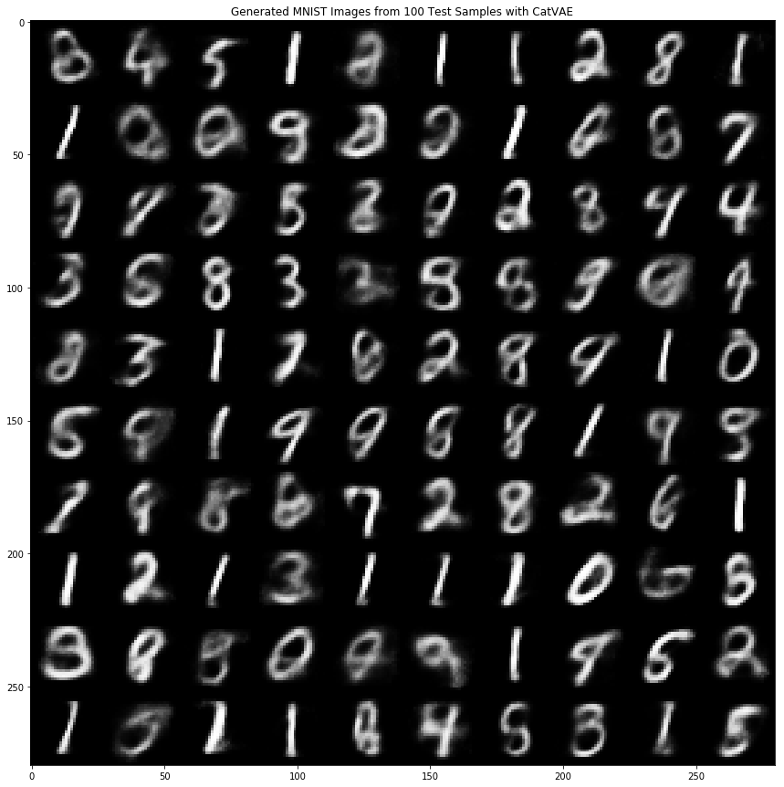

## Categorical Variational Autoencoder

### Keras, Tensorflow Probability and Eager Execution Implementation 

Straight Through Gumbel-Softmax Estimator implemented as per paper: [Categorical Reparameterization with Gumbel-Softmax](https://arxiv.org/abs/1611.01144) (No temperature, learning rate annealing.  Hard prior used)

Code developed from:
    
1) Eric Jang: 
https://github.com/ericjang/gumbel-softmax/blob/master/gumbel_softmax_vae_v2.ipynb

2) Google Seedbank Convolutional Variational Autoencoder
https://tools.google.com/seedbank/seed/5719238044024832

#### File: cat_vae_v0.1.py - Sep 24, 2018

- Tensorflow 1.10.0
- Numpy 1.14.5
- Epochs = 10
- Temperature = 1
- Learning Rate = 0.001
- Number of categorical distributions = 30

#### Items for further development:

- Anneal temperature and learning rate
- Use relaxed prior
- Increase the number of epochs
- Increase the number of categorical distributions to sample from

  <b> Example of generated MNIST images from 100 test samples</b>

